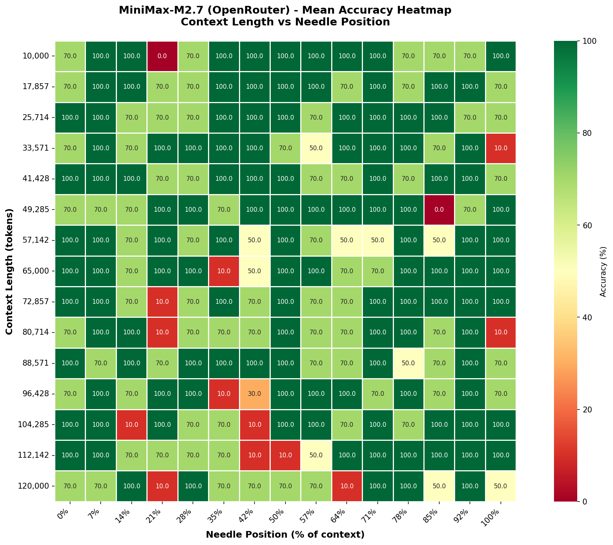
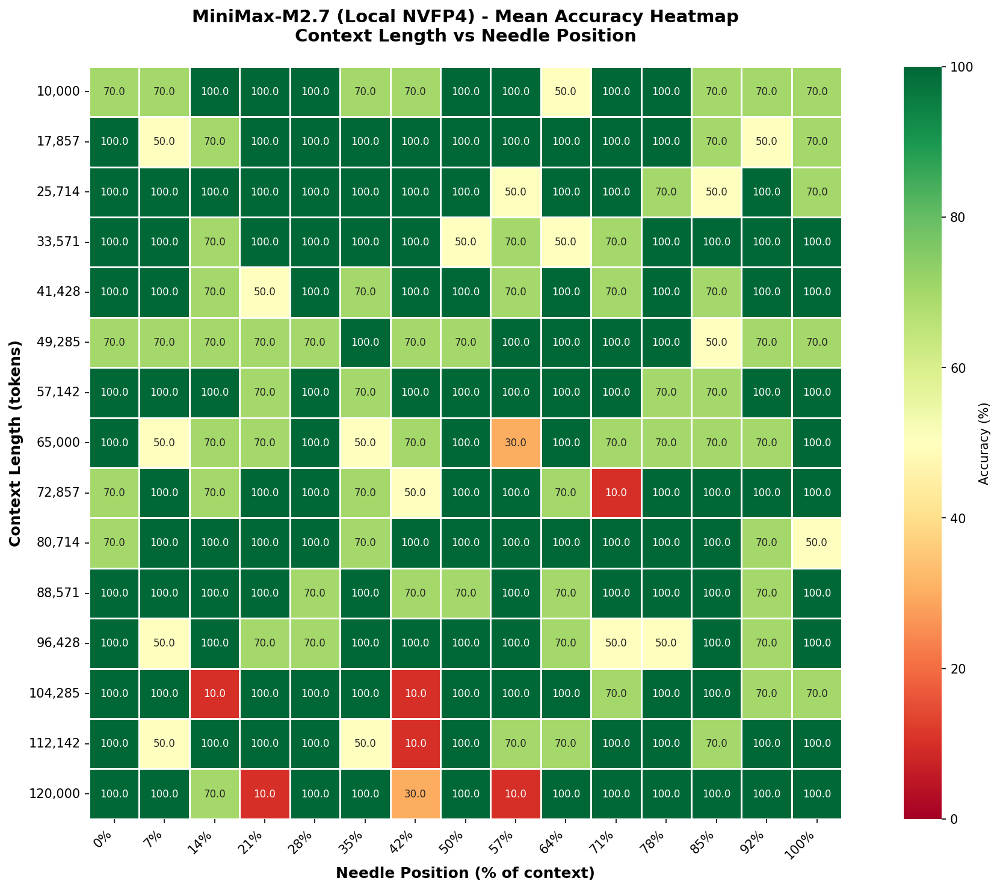
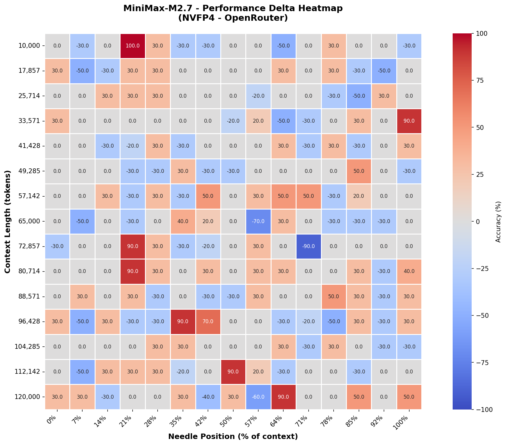

# MiniMax-M2.7 NIAH Benchmark Comparison Report

## Executive Summary

This report compares the performance of MiniMax-M2.7 on the Needle in a Haystack (NIAH) benchmark 
across two different deployment configurations:

- **KV-FP8**: minimax-m2.7 with FP8 KV cache
- **KV-NVFP4**: minimax-m2.7 with NVFP4 KV cache

NIAH Test Suite: https://github.com/UKGovernmentBEIS/inspect_evals.git

### Overall Performance

| Metric | KV-FP8 | KV-NVFP4 | Difference |
|--------|---------------|-------------|------------|
| **Overall Accuracy** | 81.780% | 84.580% | +2.800% |
| **Mean Combined Accuracy** | 81.778% | 84.578% | +2.800% |
| **Min Accuracy** | 0.0% | 10.0% | +10.0% |
| **Max Accuracy** | 100.0% | 100.0% | +0.0% |

**Key Finding**: The KV-NVFP4 configuration performance similarly to the KV-FP8

### Stability and Variance Analysis

| Metric | KV-FP8 | KV-NVFP4 | Difference |
|--------|---------------|-------------|------------|
| **Combined Std Dev** | 24.934 | 21.765 | -3.170 |
| **Context Length Std Dev** | 5.134 | 4.750 | -0.384 |
| **Position Std Dev** | 28.860 | 33.440 | +4.580 |

**Key Finding**: The KV-NVFP4 configuration performs similarly to the KV-FP8

## Detailed Performance Analysis

### Performance by Context Length

The following table shows accuracy across different context lengths:

| Context Length | KV-FP8 | KV-NVFP4 | Difference |
|----------------|---------------|-------------|------------|
| 10,000 tokens | 83.330% | 82.670% | -0.660% |
| 17,857 tokens | 88.000% | 87.330% | -0.670% |
| 25,714 tokens | 88.000% | 89.330% | +1.330% |
| 33,571 tokens | 82.670% | 87.330% | +4.660% |
| 41,428 tokens | 88.000% | 86.670% | -1.330% |
| 49,285 tokens | 83.330% | 78.670% | -4.660% |
| 57,142 tokens | 80.670% | 92.000% | +11.330% |
| 65,000 tokens | 84.670% | 74.670% | -10.000% |
| 72,857 tokens | 84.000% | 82.670% | -1.330% |
| 80,714 tokens | 74.000% | 90.670% | +16.670% |
| 88,571 tokens | 84.670% | 90.000% | +5.330% |
| 96,428 tokens | 79.330% | 82.000% | +2.670% |
| 104,285 tokens | 80.000% | 82.000% | +2.000% |
| 112,142 tokens | 76.670% | 81.330% | +4.660% |
| 120,000 tokens | 69.330% | 81.330% | +12.000% |

### Performance by Needle Position

The following table shows accuracy across different needle insertion positions:

| Position | KV-FP8 | KV-NVFP4 | Difference |
|----------|---------------|-------------|------------|
| 0% | 70.000% | 100.000% | +30.000% |
| 7% | 70.000% | 100.000% | +30.000% |
| 14% | 100.000% | 70.000% | -30.000% |
| 21% | 10.000% | 10.000% | +0.000% |
| 28% | 100.000% | 100.000% | +0.000% |
| 35% | 70.000% | 100.000% | +30.000% |
| 42% | 70.000% | 30.000% | -40.000% |
| 50% | 70.000% | 100.000% | +30.000% |
| 57% | 70.000% | 10.000% | -60.000% |
| 64% | 10.000% | 100.000% | +90.000% |
| 71% | 100.000% | 100.000% | +0.000% |
| 78% | 100.000% | 100.000% | +0.000% |
| 85% | 50.000% | 100.000% | +50.000% |
| 92% | 100.000% | 100.000% | +0.000% |
| 100% | 50.000% | 100.000% | +50.000% |

## Visual Analysis

### FP8 KV-Cache Heatmaps

**Mean accuracy heatmap** showing performance across context lengths and needle positions for KV-FP8.

### NVFP4 KV-Cache Heatmaps

**Mean accuracy heatmap** showing performance across context lengths and needle positions for KV-NVFP4.

### Performance Delta Heatmap

**Performance delta heatmap** showing the difference (KV-NVFP4 - KV-FP8) in accuracy across context lengths and needle positions. 
- **Red/negative values**: KV-FP8 outperforms
- **Green/positive values**: KV-NVFP4 outperforms
- **White (0)**: Equal performance

## Key Findings

### 1. Overall Performance
- Both models perform at similar levels and within the expected test variance.

### 2. Context Length Degradation

- **KV-FP8**: Largest context length (120,000 tokens) shows lowest accuracy (69.330%)
- **KV-NVFP4**: Largest context length (65,000 tokens) shows lowest accuracy (74.670%)

### 3. Position-Based Performance

- **KV-FP8**:
  - Early positions (0-14%): 80.000%
  - Middle positions (42-57%): 70.000%
  - Late positions (85-100%): 66.667%

- **KV-NVFP4**:
  - Early positions (0-14%): 90.000%
  - Middle positions (42-57%): 46.667%
  - Late positions (85-100%): 100.000%

### 4. Variance Analysis

- **KV-FP8**: Standard deviation of 24.934 across all test cases
- **KV-NVFP4**: Standard deviation of 21.765 across all test cases

## Conclusions

1. **KV-NVFP4 achieves similar performance**: With within test variance accuracy of the KV-FP8, the quantized 
   KV-cache configuration show now obvious degredation.
   
2. **Quantization impact**: The KV-NVFP4 preserves model capability effectively whilst allowing for 1.73x (732k vs 421k) more KV cache space.
   
## Experimental Details

### KV-FP8 Statistics
- Overall Accuracy: 81.7800%
- Mean Combined Accuracy: 81.7778% (σ=24.9345)
- Mean Context Accuracy: 81.7780% (σ=5.1338)
- Mean Position Accuracy: 69.3333% (σ=28.8598)

### KV-NVFP4 Statistics
- Overall Accuracy: 84.5800%
- Mean Combined Accuracy: 84.5778% (σ=21.7649)
- Mean Context Accuracy: 84.5780% (σ=4.7501)
- Mean Position Accuracy: 81.3333% (σ=33.4398)

---

*Report generated from experimental results collected on 2026-06-10.*
