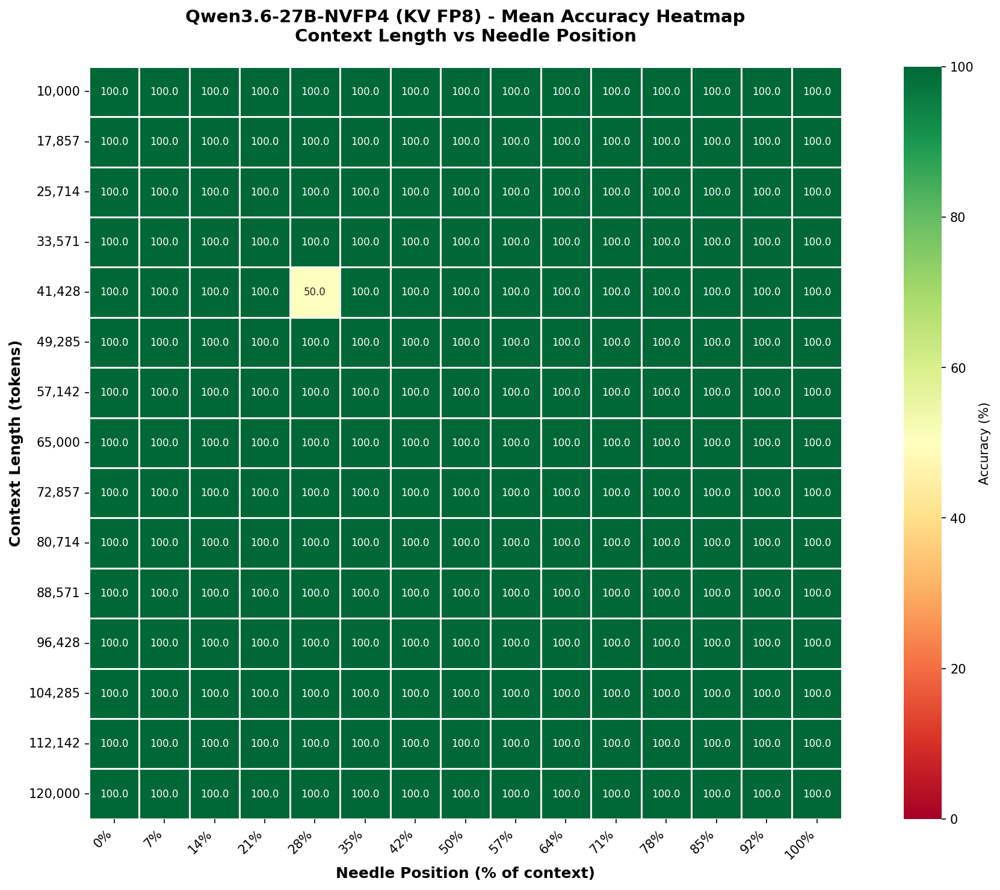
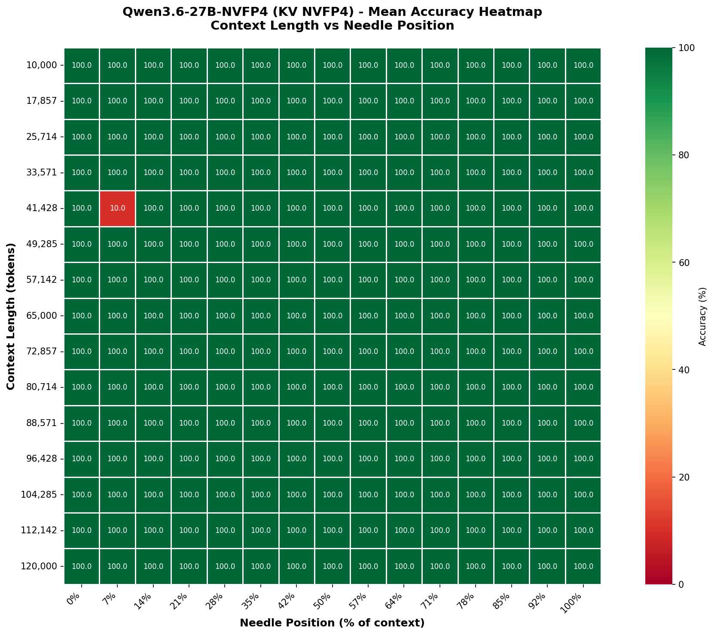
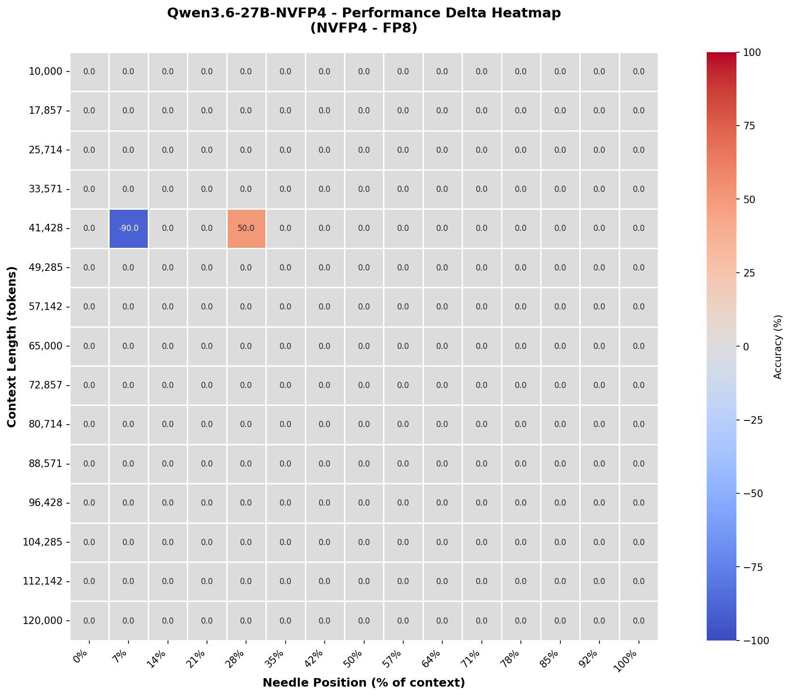

# Qwen3.6-27B-NVFP4 NIAH Benchmark Comparison Report

## Executive Summary

This report compares the performance of Qwen3.6-27B-NVFP4 on the Needle in a Haystack (NIAH) benchmark
across two different KV-cache quantization configurations:

- **KV-FP8**: Qwen3.6-27B-NVFP4 with FP8 KV cache
- **KV-NVFP4**: Qwen3.6-27B-NVFP4 with NVFP4 KV cache

NIAH Test Suite: https://github.com/UKGovernmentBEIS/inspect_evals.git

### Overall Performance

| Metric | KV FP8 | KV NVFP4 | Difference |
|--------|--------|----------|------------|
| **Overall Accuracy** | 99.780% | 99.600% | -0.180% |
| **Mean Combined Accuracy** | 99.778% | 99.600% | -0.178% |
| **Min Accuracy** | 50.0% | 10.0% | -40.0% |
| **Max Accuracy** | 100.0% | 100.0% | +0.0% |

**Key Finding**: The KV NVFP4 configuration performance similarly to the KV-FP8.

### Stability and Variance Analysis

| Metric | KV FP8 | KV NVFP4 | Difference |
|--------|--------|----------|------------|
| **Combined Std Dev** | 3.326 | 5.987 | +2.661 |
| **Context Length Std Dev** | 0.831 | 1.497 | +0.666 |
| **Position Std Dev** | 0.000 | 0.000 | +0.000 |

**Key Finding**: The KV NVFP4 configuration performs similarly to the KV-FP8

## Detailed Performance Analysis

### Performance by Context Length

The following table shows accuracy across different context lengths:

| Context Length | KV FP8 | KV NVFP4 | Difference |
|----------------|--------|----------|------------|
| 10,000 tokens | 100.000% | 100.000% | +0.000% |
| 17,857 tokens | 100.000% | 100.000% | +0.000% |
| 25,714 tokens | 100.000% | 100.000% | +0.000% |
| 33,571 tokens | 100.000% | 100.000% | +0.000% |
| 41,428 tokens | 96.670% | 94.000% | -2.670% |
| 49,285 tokens | 100.000% | 100.000% | +0.000% |
| 57,142 tokens | 100.000% | 100.000% | +0.000% |
| 65,000 tokens | 100.000% | 100.000% | +0.000% |
| 72,857 tokens | 100.000% | 100.000% | +0.000% |
| 80,714 tokens | 100.000% | 100.000% | +0.000% |
| 88,571 tokens | 100.000% | 100.000% | +0.000% |
| 96,428 tokens | 100.000% | 100.000% | +0.000% |
| 104,285 tokens | 100.000% | 100.000% | +0.000% |
| 112,142 tokens | 100.000% | 100.000% | +0.000% |
| 120,000 tokens | 100.000% | 100.000% | +0.000% |

### Performance by Needle Position

The following table shows accuracy across different needle insertion positions:

| Position | KV FP8 | KV NVFP4 | Difference |
|----------|--------|----------|------------|
| 0% | 100.000% | 100.000% | +0.000% |
| 7% | 100.000% | 100.000% | +0.000% |
| 14% | 100.000% | 100.000% | +0.000% |
| 21% | 100.000% | 100.000% | +0.000% |
| 28% | 100.000% | 100.000% | +0.000% |
| 35% | 100.000% | 100.000% | +0.000% |
| 42% | 100.000% | 100.000% | +0.000% |
| 50% | 100.000% | 100.000% | +0.000% |
| 57% | 100.000% | 100.000% | +0.000% |
| 64% | 100.000% | 100.000% | +0.000% |
| 71% | 100.000% | 100.000% | +0.000% |
| 78% | 100.000% | 100.000% | +0.000% |
| 85% | 100.000% | 100.000% | +0.000% |
| 92% | 100.000% | 100.000% | +0.000% |
| 100% | 100.000% | 100.000% | +0.000% |

## Visual Analysis

### FP8 KV-Cache Heatmaps

**Mean accuracy heatmap** showing performance across context lengths and needle positions for KV-FP8.

### NVFP4 KV-Cache Heatmaps

**Mean accuracy heatmap** showing performance across context lengths and needle positions for KV-NVFP4.

### Performance Delta Heatmap

**Performance delta heatmap** showing the difference (KV-NVFP4 - KV-FP8) in accuracy across context lengths and needle positions.
- **Red/negative values**: KV-FP8 outperforms
- **Green/positive values**: KV-NVFP4 outperforms
- **White (0)**: Equal performance

## Key Findings

### 1. Overall Performance
- Both models perform at similar levels and within the expected test variance.

### 2. Context Length Degradation

- **KV-FP8**: Largest context length (41,428 tokens) shows lowest accuracy (96.670%)
- **KV-NVFP4**: Largest context length (41,428 tokens) shows lowest accuracy (94.000%)

### 3. Position-Based Performance

- **KV-FP8**:
  - Early positions (0-14%): 100.000%
  - Middle positions (42-57%): 100.000%
  - Late positions (85-100%): 100.000%

- **KV-NVFP4**:
  - Early positions (0-14%): 100.000%
  - Middle positions (42-57%): 100.000%
  - Late positions (85-100%): 100.000%

### 4. Variance Analysis

- **KV-FP8**: Standard deviation of 3.326 across all test cases
- **KV-NVFP4**: Standard deviation of 5.987 across all test cases

## Conclusions

1. **KV-NVFP4 achieves similar performance**: With within test variance accuracy of the KV-FP8, the quantized 
   KV-cache configuration show now obvious degredation.
   
2. **Quantization impact**: The KV-NVFP4 preserves model capability effectively whilst allowing for 1.65x (2.98M vs 1.8M) more KV cache space.
   
## Experimental Details

### KV-FP8 Statistics
- Overall Accuracy: 99.7800%
- Mean Combined Accuracy: 99.7778% (σ=3.3259)
- Mean Context Accuracy: 99.7780% (σ=0.8306)
- Mean Position Accuracy: 100.0000% (σ=0.0000)

### KV-NVFP4 Statistics
- Overall Accuracy: 99.6000%
- Mean Combined Accuracy: 99.6000% (σ=5.9867)
- Mean Context Accuracy: 99.6000% (σ=1.4967)
- Mean Position Accuracy: 100.0000% (σ=0.0000)

---

*Report generated from experimental results collected on 2026-06-11.*
